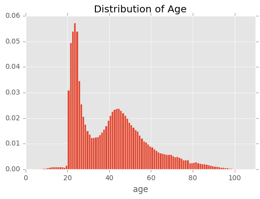
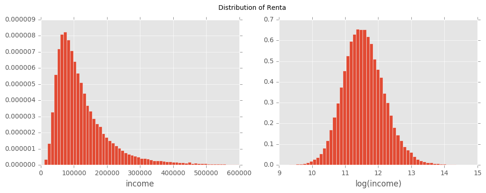

# Santander-Product-Recommendation
My personal solution for kaggle challenge [Santander Product Recommendation](https://www.kaggle.com/c/santander-product-recommendation)
## EDA and Data Clean
1. Both train set and test set are full of missing value. Since lot of the columns are categorical, the first step is fill all missing value with -1, and code the categorical variable to continuously integer.  
2. cod_prov (code of province) and nomprov (name of province) are express same information, thus drop column nomprov.  
3. ult_fec_cli_1t contains 90% of empty value, which infer the account is still primary by end of the month. This column is transfered to 1 and 0, stand for primary or not.  
4. fecha_alta is the date of establish the account, which convert to the days to the fecha_dato.  

### Data impurity  

1. age consits with two normal distribution, one group mean is young adults, and the other is for mid-age adults. The missing value is filled with the average 40.  

2. renta is the income of the costumer. Since the average income varies from different area, the missing value is filled the mean of each area code. The area with missing area code, filled with the total average. The log of the renta is followed the normal distribution, so transfer this column to log(renta).  

3. antiguedad is customer seniority. Missing value is filled with 0.
